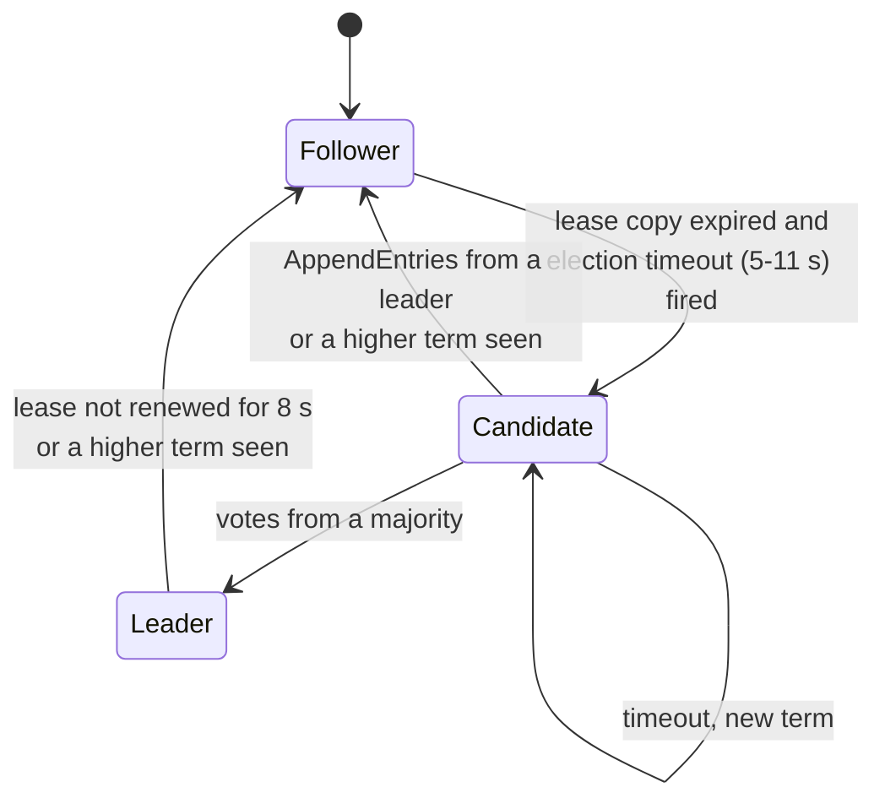
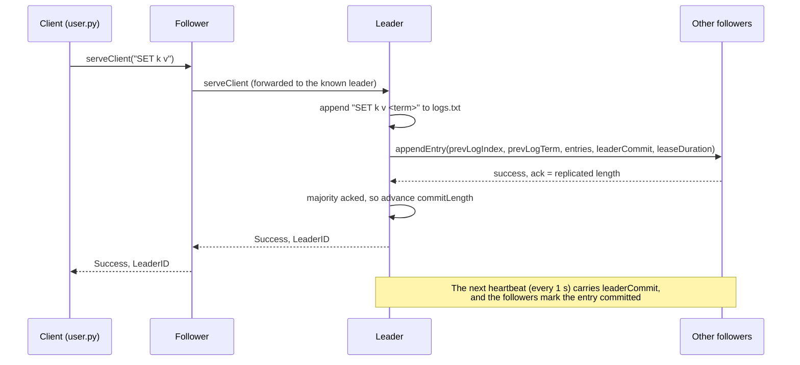

# Raft Consensus with Leader Leases (Python + gRPC)

A replicated key-value store built on the [Raft](https://raft.github.io/raft.pdf) consensus
algorithm, extended with **leader leases** so the leader can answer reads without a round of
messages to its followers. Every node is a separate process and nodes talk to each other over
gRPC. Each node writes its log, its term, its vote and its commit index to disk, so it can crash,
restart and catch up.

Built as a team project for **CSE530 Distributed Systems: Concepts & Design (DSCD)** at
IIIT-Delhi (Winter 2024).

## Contents

- [How Raft works here](#how-raft-works-here)
- [Features](#features)
- [Architecture](#architecture)
- [Quick start](#quick-start)
- [Running a cluster by hand](#running-a-cluster-by-hand)
- [Failure scenarios to try](#failure-scenarios-to-try)
- [Configuration](#configuration)
- [Project structure](#project-structure)
- [Known limitations](#known-limitations)
- [Credits](#credits)

## How Raft works here

Raft keeps a log of commands identical on a cluster of servers, as long as a majority of them are
up. Time is divided into **terms**, and each term starts with an election:

1. Every node starts as a **follower**. If it hears nothing from a leader before its randomised
   election timeout fires, it becomes a **candidate**, increments the term and asks the other
   nodes for votes (`RequestVote`).
2. A candidate that collects votes from a majority becomes the **leader** for that term. A node
   votes at most once per term, and only for a candidate whose log is at least as up to date as
   its own.
3. The leader appends client writes to its log and replicates them with `AppendEntries`, which
   also serves as the heartbeat. An entry is **committed** once a majority of nodes store it.

**Leader leases.** A plain Raft leader cannot be sure it is still the leader without contacting a
majority, so even reads cost a round of messages. Here the leader holds a time-limited *lease*
(8 s). It renews the lease whenever a heartbeat round reaches a majority, and it steps down when
the lease runs out. Every `AppendEntries` carries the lease duration, and followers keep their
own copy of the lease. A follower does not start an election until that copy has expired. So a
new leader cannot be elected while the old one may still be serving reads, and the leader can
answer `GET` from its local log. (See the Yugabyte post in the references for background.)

## Features

What the code in `src/node.py` implements:

- **Leader election** with randomised election timeouts (5 to 11 s, chosen once per node), a
  log-up-to-date check before granting a vote, and a step-down when a node sees a higher term.
- **Log replication** in the style of Kleppmann's Raft pseudocode (`sentLength` / `ackedLength`
  per follower). Follower logs are repaired by backing off `prevLogIndex` until the logs match,
  and a leader commits only entries from its current term. A new leader appends a `NO-OP` entry.
- **Heartbeats** every 1 s, sent as `AppendEntries`, which also carry the lease.
- **Leader lease.** Reads (`GET`) and writes (`SET`) are served only while the leader holds a
  valid lease, and a leader that cannot renew its lease for 8 s steps down. Followers do not
  campaign while they still hold a lease from the current leader.
- **Key-value store** with `SET <key> <value>` and `GET <key>`. `SET` returns once a majority
  has the entry.
- **Request forwarding.** Any node accepts client requests, and followers forward them to the
  leader they know. Replies include `LeaderID` so the client can talk to the leader directly.
- **Persistence and recovery.** Each node keeps `logs_node_<id>/` with `logs.txt` (the
  replicated log), `metadata.txt` (commit length, term and voted-for) and `dump.txt` (a
  human-readable event trace). A restarted node reloads them and catches up from the leader.

The three RPCs are defined in [`src/ProtoBufs/raft.proto`](src/ProtoBufs/raft.proto):
`appendEntry`, `requestVote` and `serveClient`. The first two follow Figure 2 of the Raft paper,
with an added `leaseDuration` field:

<p align="center"></p>

## Architecture





Every node runs a gRPC server on its own thread pool, plus a main loop that acts on the node's
role: followers wait for a timer to fire, candidates request votes, and leaders send a heartbeat
every second. Node-to-node RPCs have a 1 s deadline, so a crashed peer cannot stall the loop.

## Quick start

You need Python 3.10 or newer; the demo was run on Python 3.13. The commands below use
[uv](https://docs.astral.sh/uv/), but a plain `python -m venv` and
`pip install -r requirements.txt` work too.

**Windows (PowerShell)**

```powershell
git clone https://github.com/happyc0der/raft-leader-lease-kv.git
cd raft-leader-lease-kv
uv venv
.venv\Scripts\activate
uv pip install -r requirements.txt
python scripts/demo_cluster.py
```

**macOS / Linux**

```bash
git clone https://github.com/happyc0der/raft-leader-lease-kv.git
cd raft-leader-lease-kv
uv venv
source .venv/bin/activate
uv pip install -r requirements.txt
python scripts/demo_cluster.py
```

`scripts/demo_cluster.py` starts a five-node cluster on `localhost:4040-4044` and then runs these
checks:

1. A leader is elected.
2. Writes succeed both through a follower and through the leader.
3. Every node returns the written value.
4. After the leader is killed, a new leader is elected and the committed data is still there.
5. A new write succeeds on the new leader.
6. The restarted old leader catches up on the write it missed.

The script stops every node process it started and exits non-zero if any check fails. The output
below is from a real run on Windows 11 with Python 3.13:

```text
[   0.1s] waiting for a leader (election timeouts are 5-11 s)...
[   6.3s] PASS leader elected
[   6.3s] node 2 is the leader
[   6.4s] PASS SET course DSCD via follower 0 (forwarded to leader)
[   6.4s] PASS SET algorithm raft via leader 2
[   6.5s] GET algorithm from every node -> {0: 'raft', 1: 'raft', 2: 'raft', 3: 'raft', 4: 'raft'}
[   6.5s] PASS every node returns algorithm=raft
[   8.5s] node 0 log: ['NO-OP 1', 'SET course DSCD 1', 'SET algorithm raft 1']
  ... (identical logs on nodes 1-4)
[   8.5s] killed node 2 (simulated crash)
[   8.5s] waiting for re-election (followers wait for the 8 s lease to lapse, then 5-11 s)...
[  21.8s] PASS new leader elected after leader crash
[  21.8s] node 4 is the new leader (13.3s after the crash)
[  21.8s] PASS committed data survives leader failure (GET course -> DSCD)
[  22.9s] PASS SET after_failover yes on the new leader
[  22.9s] started node 2 on localhost:4042 (pid 31688)
[  24.9s] PASS restarted node 2 caught up on the write it missed
[  24.9s] node 2 log after restart: ['NO-OP 1', 'SET course DSCD 1', 'SET algorithm raft 1', 'NO-OP 2', 'SET after_failover yes 2']
[  24.9s] all node processes stopped

8/8 checks passed.
```

Each log entry is stored as `<command> <term>`. The `NO-OP 2` entry is the no-op the new leader
appended in term 2.

There is also a quick in-process regression test for log repair. It runs in a few seconds and
starts no processes:

```bash
python -m unittest discover -s tests -v
```

## Running a cluster by hand

Run these commands from the repository root with the virtual environment active. Each node
stores its state in `logs_node_<id>/` under the current directory. These folders are
git-ignored; delete them to start from an empty cluster.

**Windows (PowerShell).** This opens one console window per node:

```powershell
0..4 | ForEach-Object { Start-Process python -ArgumentList "src/node.py", "--id", $_ }
```

**macOS / Linux**

```bash
for i in 0 1 2 3 4; do python src/node.py --id $i > node_$i.out 2>&1 & done
```

Wait about 10 s for an election, then use the client. It sends requests to node 0 first and
follows the `LeaderID` hint:

```text
$ python src/user.py SET city delhi
🚀 Sending request to node with ID-0
✅ Success: Request has been processed successfully.
Response: SET city delhi successfully committed.

$ python src/user.py GET city
🚀 Sending request to node with ID-0
✅ Success: Request has been processed successfully.
Response: delhi
```

Run `python src/user.py` with no arguments for the original interactive `GET`/`SET` menu. A
leader's console shows the protocol as it runs:

```text
⏰ Election timeout triggered...
🗳  Requesting votes...
❎ Response recieved from Node- 1
🎉 Leader elected: 0
✅ Log replicated to Node-1
STATE COMMITED: NO-OP
♥ Successful Heartbeat Count: 2
```

To stop the nodes, close their windows on Windows, or run `pkill -f src/node.py` on macOS/Linux.

## Failure scenarios to try

These were run on a local five-node cluster. Commit rules and lease renewal both need a
majority, which is 3 of 5 nodes.

| Scenario | What to do | What happens |
|---|---|---|
| Leader crash | Kill the leader's process | Followers keep their lease copy for up to 8 s, then wait out their election timeout. A new leader took 13 to 17 s in our runs, and committed data was still readable. |
| Minority failure | Kill 2 followers | Writes and reads keep working with 3 of 5 nodes. |
| Majority loss | Kill 3 of 5 nodes | `SET` returns `Could not replicate to a majority of nodes.` Once its lease lapses, the leader steps down, and requests return `No leader known yet; retry shortly.` |
| Recovery | Restart the killed nodes | A leader is elected again, and the restarted nodes reload `logs_node_<id>/` and catch up. |
| Node restart | Kill any follower and start it again | It reloads its log, term and vote from disk, and the leader backfills the entries it missed. |

As in any Raft system, a failed `SET` does not guarantee the write was dropped. The entry stays
in the leader's log and can still commit once enough nodes return. In the majority-loss test, a
key whose `SET` had failed was readable after recovery. `SET` is idempotent, so retrying it is
safe.

## Configuration

| Option | Default | Purpose |
|---|---|---|
| `--id N` (node) | prompted | This node's index in the cluster list |
| `--cluster host:port,...` (node and client) or `RAFT_CLUSTER` | `localhost:4040` ... `localhost:4044` | Every node's address, in id order. Must be the same on every node. |
| `--data-dir DIR` (node) or `RAFT_DATA_DIR` | current directory | Where `logs_node_<id>/` is written |
| `--retries N` (client) | 10 | Attempts for a one-shot client command |

For example, a three-node cluster on other ports:

```bash
export RAFT_CLUSTER=localhost:5050,localhost:5051,localhost:5052   # PowerShell: $env:RAFT_CLUSTER = "..."
python src/node.py --id 0   # and --id 1, --id 2 in other terminals
python src/user.py SET lang python
```

The timing constants are in `src/node.py`:

- Election timeout: 5 to 11 s, set in `initialize_node`.
- Lease: 8 s (`max_lease_duration`).
- Heartbeat interval: 1 s, in `start_client`.
- RPC deadline: 1 s (`RPC_TIMEOUT`).

To regenerate the gRPC stubs after you edit the `.proto` file:

```bash
uv pip install -r requirements-dev.txt
python -m grpc_tools.protoc -I src/ProtoBufs --python_out=src --pyi_out=src --grpc_python_out=src src/ProtoBufs/raft.proto
```

## Project structure

```text
.
├── src/
│   ├── node.py              # Raft node: gRPC servicer, election, replication, lease, persistence
│   ├── user.py              # Client: one-shot `SET`/`GET` or interactive menu, follows leader hints
│   ├── cluster_config.py    # Parses --cluster / RAFT_CLUSTER
│   ├── custom_timer.py      # LeaseTimer (threading.Timer that can report time left)
│   ├── metadata.py          # Reads/writes logs_node_<id>/metadata.txt
│   ├── ProtoBufs/raft.proto # RPC and message definitions
│   ├── raft_pb2*.py[i]      # Generated protobuf / gRPC code
│   └── test.py              # Scratch check of LeaseTimer.time_left()
├── scripts/demo_cluster.py  # End-to-end smoke test: election, replication, failover, catch-up
├── tests/test_log_repair.py # Unit test: a leader repairs a follower 1500 entries behind
├── images/RPCs.png          # RPC summary (Raft paper, Figure 2)
├── requirements.txt         # grpcio, protobuf
└── requirements-dev.txt     # + grpcio-tools for regenerating stubs
```

## Known limitations

This is a course project, not a production system:

- **Values:** keys and values must be single tokens with no whitespace.
- **Reads:** `GET` scans the leader's log for the latest `SET` of that key. The scan includes
  entries that are not committed yet (for example, a `SET` that failed to reach a majority).
- **Log storage:** there is no snapshotting or log compaction, and `logs.txt` is rewritten on
  every append.
- **Lease handoff:** `RequestVoteResponse.leaseDuration` exists but voters leave it at 0. The
  guard against overlapping leases is that followers do not campaign until their lease copy
  has expired, plus the election timeout that follows.
- **Membership:** it is fixed. On restart, a node takes its term from its last log entry.
- **Concurrency:** gRPC worker threads and the main loop share node state with only light
  locking.
- **Security:** RPCs use insecure gRPC channels, with no TLS and no authentication.

## Credits

Team (IIIT-Delhi, CSE530 DSCD, 2024):

- **Aditya Ahuja** ([@adityaahuja7](https://github.com/adityaahuja7)): node structure,
  election, log replication responses, client, request forwarding. This repository started as a
  fork of [adityaahuja7/Raft-Implementation](https://github.com/adityaahuja7/Raft-Implementation).
- **Deeptanshu Barman:** replication and commit RPC logic, leader-lease timers, metadata and
  dump persistence.
- **Keshav Rajput** ([@happyc0der](https://github.com/happyc0der)): leader-lease functionality
  and bug fixes, and the later maintenance work described below.

The full commit history is preserved.

**Maintenance after the course (2026).** The following changes were made so the project runs on
current Python and gRPC releases:

- Regenerated the stubs, and made `voteGranted` a `bool`, because current protobuf rejects
  `True` in an `int32` field, which broke every vote.
- Made the cluster addresses and data directory configurable.
- Fixed these bugs:
  - Votes from earlier terms were counted in later elections.
  - The step-down on a higher-term vote reply could never run.
  - Majority checks did not count the leader itself.
  - A voter did not reset its election timer after granting a vote.
  - Log repair recursed once per missing entry (`replicate_log` and `recieve_log_ack` called
    each other), so a follower about 500 entries behind hit Python's recursion limit. The error
    was reported as a failed RPC, and heartbeats to that follower failed until it caught up. The
    leader now retries in a loop.
- Added RPC deadlines and removed a busy-wait loop.
- Added the demo script, `requirements.txt` and this README.

### References

- Diego Ongaro and John Ousterhout, [In Search of an Understandable Consensus Algorithm](https://raft.github.io/raft.pdf) (the Raft paper)
- Martin Kleppmann, *Distributed Systems* lecture notes (University of Cambridge), Raft pseudocode
- Yugabyte, [Low latency reads in geo-distributed SQL with Raft leader leases](https://www.yugabyte.com/blog/low-latency-reads-in-geo-distributed-sql-with-raft-leader-leases/)
- Raft explained: [part 1](https://towardsdatascience.com/raft-algorithm-explained-a7c856529f40), [part 2](https://towardsdatascience.com/raft-algorithm-explained-2-30db4790cdef)

Licensed under the [Apache License 2.0](LICENSE).
